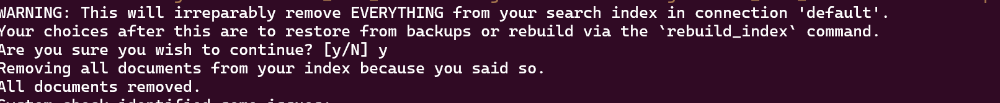

# Django project deploy tool

This set of scripts is homework for DevOPS01 cource

## TASK:

Task description goes here^

https://github.com/DevOps01-ua/Linux01/blob/main/homework/HW1.md

In few words the scripts should deploy sample project https://github.com/Manisha-Bayya/simple-django-project

## USAGE:

### 1. Clone git repository

```bash
git clone "https://github.com/keefeere/linux_HW01.git"
cd linux_HW01
```

### 2. Enter user data

Open file ```provisionmysql.sh``` with any editor and enter your variables for mail server

Better use GMail but not forget that for SMTP you must enable [passwords for appliations](https://support.google.com/mail/answer/185833https:/)

```bash
export EMAIL_HOST_USER='your_user@gmail.com'
export EMAIL_HOST_PASSWORD='pass'
```

### 3. Run provision

This will install MySQL server and provision it's root passwort and other data to main script throught environment variables

Open dir with scripts, set execution rights and run

```bash
cd /your dir
chmod +x provisionmysqlenv.sh
. provisionmysqlenv.sh
```

**TIP:** Run with ```. provisionmysqlenv.sh``` not with ```.\provisionmysqlenv.sh``` because this script will be executed in curren shell and script will set current shell environment variables

### 4. Run main script

In dir with scrips run:

```bash
cp startdjango.sh ~
cd ~
rm -rf simple-django-project
rm -rf envs
chmod +x startdjango.sh
./startdjango.sh
```

When scrips prompts:
*WARNING: This will irreparably remove EVERYTHING from your search index in connection 'default'.
Your choices after this are to restore from backups or rebuild via the `rebuild_index` command.
Are you sure you wish to continue? [y/N]*
Press ```y```


